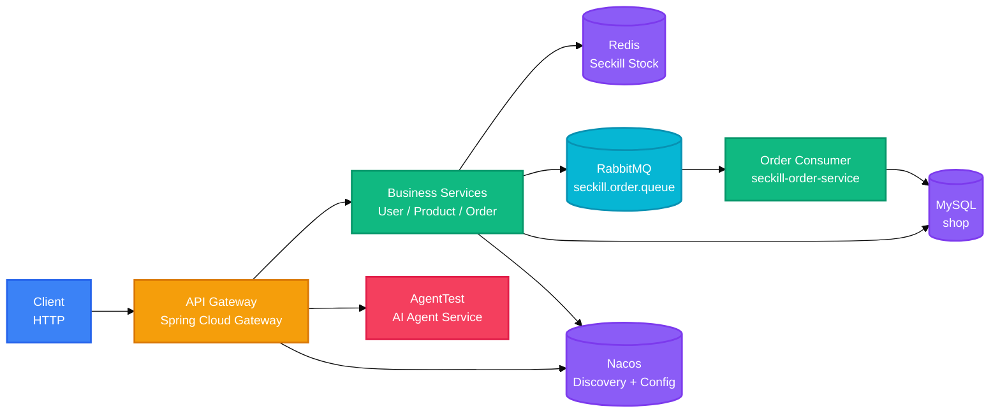

<div align="right">

[English](README.md) · 中文

</div>

<h1 align="center">Seckill Parent</h1>

<p align="center">
  <strong>基于 Spring Cloud 的秒杀微服务系统，包含网关、用户、商品和订单服务。</strong>
  <br />
  <em>网关 · Nacos · Redis · RabbitMQ · MySQL · JWT</em>
</p>

<p align="center">
  <a href="#快速开始"></a>
</p>

<p align="center">
  
  
  
  
  
  
</p>

## 功能特性

| 功能 | 说明 |
|---|---|
| 网关路由 | Spring Cloud Gateway 将 `/api/auth/**`、`/api/products/**`、`/api/orders/**` 和 `/api/seckill` 转发到对应服务，并聚合 Knife4j 接口文档。 |
| Redis 库存预热 | 订单服务启动时将 `p1`、`p2`、`p3` 的库存写入 `seckill:stock:{productId}`，过期时间为 7 天。 |
| 原子扣减库存 | 秒杀请求通过 Redis `DECR` 扣减库存，库存为负时回滚。 |
| 异步创建订单 | 扣减成功后向 `seckill.order.queue` 发送消息，RabbitMQ 消费者创建已支付订单。 |
| Feign 库存同步 | 订单服务异步调用 `product-service`，以 `stock >= quantity` 条件同步扣减 MySQL 库存。 |
| JWT 鉴权 | 登录签发 24 小时 Token；用户信息和订单查询需要 Bearer Token，admin 角色可查看全部订单。 |

## 快速开始
### 依赖服务
- **Agent 服务**：提供 AI 对话能力，独立项目 [agent-service]
    https://github.com/MoYvOvO/agent-service，需先启动。
### 环境要求

- JDK 17
- MySQL 数据库 `shop`
- Redis
- RabbitMQ
- Nacos，且 `DEFAULT_GROUP` 下存在 `common-db.properties` 和 `common-redis.properties`
- 可选：Sentinel 控制台和 Zipkin

### 修改配置

替换各模块 `application.properties` 和 Nacos 配置中的开发环境凭据。数据库密码、RabbitMQ 密码和 `JwtConstant.SECRET_KEY` 均为开发值，不应直接用于生产环境。

### 构建

```bash
./mvnw clean package
```

### 启动

```bash
java -jar seckill-user-service/target/seckill-user-service-0.0.1-SNAPSHOT.jar
java -jar seckill-product-service/target/seckill-product-service-0.0.1-SNAPSHOT.jar
java -jar seckill-order-service/target/seckill-order-service-0.0.1-SNAPSHOT.jar
java -jar seckill-gateway/target/seckill-gateway-0.0.1-SNAPSHOT.jar
```

服务端口为 `8083`（用户）、`8081`（商品）和 `8082`（订单）。网关未配置 `server.port`，使用 Spring Boot 默认端口 `8080`。

## 使用示例

### 登录

```bash
curl -X POST http://localhost:8083/api/auth/login \
  -H "Content-Type: application/json" \
  -d '{"username": "user1", "password": "<password>"}'
```

### 商品列表

```bash
curl http://localhost:8080/api/products
```

### 秒杀下单

```bash
curl -X POST http://localhost:8080/api/seckill \
  -H "Content-Type: application/json" \
  -d '{"username": "user1", "productId": "p1"}'
```

### 订单列表

```bash
curl -H "Authorization: Bearer <token>" http://localhost:8080/api/orders
```

## 系统架构

系统采用微服务结构：网关统一接入用户、商品和订单服务，订单服务通过 Redis、RabbitMQ 和 Feign 完成秒杀流程。



秒杀下单流程如下。

```mermaid
%%{init: {'theme': 'base', 'themeVariables': {'fontSize': '14px'}}}%%
sequenceDiagram
    participant C as Client
    participant G as Gateway
    participant O as Order Service
    participant R as Redis
    participant M as RabbitMQ
    participant S as Order Consumer
    participant P as Product Service
    participant DB as MySQL

    C->>G: POST /api/seckill {username, productId}
    G->>O: forward to order-service
    O->>R: DECR seckill:stock:{productId}
    alt remaining stock < 0
        R-->>O: negative value
        O->>R: INCR rollback
        O-->>C: sold out
    else stock available
        O->>P: PUT /api/products/{id}/deduct (async)
        O->>M: publish seckill.order
        O-->>C: pending order
        M->>S: consume seckill.order.queue
        S->>P: GET /api/products/{id}
        P-->>S: product
        S->>DB: INSERT order (paid)
    end

    classDef client fill:#3B82F6,stroke:#2563EB,color:#fff
    classDef gateway fill:#F59E0B,stroke:#D97706,color:#fff
    classDef service fill:#10B981,stroke:#059669,color:#fff
    classDef queue fill:#06B6D4,stroke:#0891B2,color:#fff
    classDef data fill:#8B5CF6,stroke:#7C3AED,color:#fff

    class C client
    class G gateway
    class O,S,P service
    class M queue
    class R,DB data
```

## 配置

各服务配置位于 `src/main/resources/application.properties`；商品、订单和用户服务还会从 Nacos 导入共享配置。

| 配置项 | 说明 | 默认值 |
|---|---|---|
| `server.port` | 服务端口 | 用户 `8083`、商品 `8081`、订单 `8082`、网关 `8080` |
| `spring.application.name` | 注册到 Nacos 的服务名 | `user-service`、`product-service`、`order-service`、`seckill-gateway` |
| `spring.cloud.nacos.discovery.server-addr` | Nacos 地址 | `localhost:8848` |
| `spring.datasource.url` | MySQL JDBC 地址 | `jdbc:mysql://localhost:3306/shop` |
| `spring.datasource.username` / `password` | 数据库账号 | `<configured>` |
| `spring.data.redis.host` | Redis 地址 | `localhost` |
| `spring.rabbitmq.host` / `port` | RabbitMQ 地址 | `localhost` / `5672` |
| `spring.rabbitmq.username` / `password` | RabbitMQ 账号 | `guest` / `<configured>` |
| `spring.cloud.sentinel.transport.dashboard` | Sentinel 控制台 | `localhost:8858` |
| `management.zipkin.tracing.endpoint` | Zipkin 上报地址 | `http://localhost:9411/api/v2/spans` |
| `spring.config.import[0]` | Nacos Redis 配置 | `nacos:common-redis.properties?group=DEFAULT_GROUP` |
| `spring.config.import[1]` | Nacos 数据库配置 | `nacos:common-db.properties?group=DEFAULT_GROUP` |
| `knife4j.gateway.routes` | 聚合接口文档路由 | 订单、商品、用户服务 |

## API

### 网关路由

| 路径 | 目标 |
|---|---|
| `/api/auth/**` | `user-service` |
| `/api/products/**` | `product-service` |
| `/api/orders/**`、`/api/seckill` | `order-service` |
| `/api/agent/**` | `AgentTest`，重写为 `/ai/**` |
| `/doc.html`、`/webjars/**` | Knife4j 聚合文档 |

### 用户服务

| 方法 | 路径 | 说明 | 鉴权 |
|---|---|---|---|
| POST | `/api/auth/login` | 登录并获取 JWT | 无 |
| POST | `/api/auth/register` | 注册新用户 | 无 |
| GET | `/api/auth/me` | 当前用户信息 | Bearer |

### 商品服务

| 方法 | 路径 | 说明 | 鉴权 |
|---|---|---|---|
| GET | `/api/products` | 查询全部商品 | 无 |
| POST | `/api/products` | 新增商品 | 无 |
| PUT | `/api/products/{productId}` | 修改商品 | 无 |
| DELETE | `/api/products/{productId}` | 删除商品 | 无 |
| GET | `/api/products/{productId}` | 商品详情 | 无 |
| PUT | `/api/products/{productId}/deduct?quantity=` | 条件扣减库存 | 无 |
| GET | `/api/products/{productId}/stock` | 查询当前库存 | 无 |

### 订单服务

| 方法 | 路径 | 说明 | 鉴权 |
|---|---|---|---|
| GET | `/api/orders` | 查询订单；admin 查看全部，其他用户查看自己的 | Bearer |
| PATCH | `/api/orders/{orderId}/status` | 更新订单状态 | 无 |
| POST | `/api/seckill` | 创建秒杀订单 | 无 |

## 项目结构

```
work/
├── pom.xml                    # seckill-parent
├── mvnw / mvnw.cmd
├── seckill-common/            # 共享实体、Result、JWT 常量
├── seckill-user-service/      # 认证服务（8083）
├── seckill-product-service/   # 商品与库存服务（8081）
├── seckill-order-service/     # 秒杀订单服务（8082）
├── seckill-gateway/           # API 网关与 Knife4j 聚合
└── src/                       # 早期的独立 work 应用
```

## 技术栈

### 后端

| 技术 | 用途 |
|---|---|
| Java 17 | 运行环境 |
| Spring Boot 3.5.0 | 应用框架 |
| Spring Cloud 2025.0.0 | 网关、OpenFeign、LoadBalancer |
| Spring Cloud Alibaba 2025.0.0.0 | Nacos 与 Sentinel |
| MyBatis-Plus 3.5.16 | 数据访问 |
| Maven | 构建与模块管理 |

### 基础设施

| 技术 | 用途 |
|---|---|
| MySQL | 商品、订单和用户数据 |
| Redis | 秒杀库存与缓存 |
| RabbitMQ | 异步订单创建 |
| Nacos | 服务发现与配置 |
| Sentinel | 流量控制 |
| Zipkin + Brave | 分布式链路追踪 |
| Knife4j 4.5.0 | 聚合接口文档 |
| JJWT 0.12.3 | JWT 生成与解析 |
| Spring Boot Actuator | 健康检查与信息端点 |

## 贡献指南

1. Fork 仓库
2. 创建功能分支（`git checkout -b feature/your-feature`）
3. 提交修改（`git commit -m 'feat: add your feature'`）
4. 推送分支（`git push origin feature/your-feature`）
5. 提交 Pull Request

---

未检测到 LICENSE 文件。建议添加 LICENSE 以明确项目授权。

<!-- BEAUTIFIED -->
