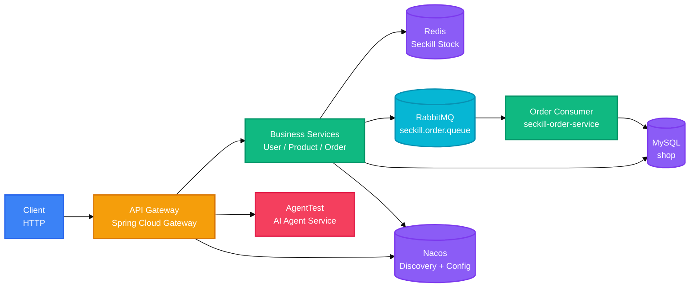

<div align="right">

[English](README.md) · [中文](README-zh.md)

</div>

<h1 align="center">Seckill Parent</h1>

<p align="center">
  <strong>Microservice seckill platform with gateway routing, JWT auth, Redis stock control, and RabbitMQ order processing.</strong>
  <br />
  <em>Gateway · Nacos · Redis · RabbitMQ · MySQL · JWT</em>
</p>

<p align="center">
  <a href="#quick-start"></a>
</p>

<p align="center">
  
  
  
  
  
  
</p>

## Features

| Feature | Description |
|---|---|
| Gateway routing | Spring Cloud Gateway forwards `/api/auth/**`, `/api/products/**`, `/api/orders/**`, and `/api/seckill` to the matching services and aggregates Knife4j API docs. |
| Redis stock preheat | The order service loads stock for `p1`, `p2`, and `p3` into `seckill:stock:{productId}` at startup with a 7-day TTL. |
| Atomic stock deduction | Seckill requests use `DECR` on the Redis key and roll the stock back when it becomes negative. |
| Async order creation | After deduction, a message is published to `seckill.order.queue`; the RabbitMQ consumer creates the paid order. |
| Feign stock sync | The order service calls `product-service` asynchronously to deduct stock in MySQL with a `stock >= quantity` condition. |
| JWT authentication | Login issues a 24-hour token; user info and order queries require a Bearer token, and the admin role sees all orders. |

## Quick Start

### Prerequisites

- JDK 17
- MySQL database `shop`
- Redis
- RabbitMQ
- Nacos with `common-db.properties` and `common-redis.properties` in `DEFAULT_GROUP`
- Optional: Sentinel dashboard and Zipkin

### Configure

Replace development-only credentials in the module `application.properties` files and Nacos configs. The database password, RabbitMQ password, and `JwtConstant.SECRET_KEY` are dev values and should not be used in production.

### Build

```bash
./mvnw clean package
```

### Run

```bash
java -jar seckill-user-service/target/seckill-user-service-0.0.1-SNAPSHOT.jar
java -jar seckill-product-service/target/seckill-product-service-0.0.1-SNAPSHOT.jar
java -jar seckill-order-service/target/seckill-order-service-0.0.1-SNAPSHOT.jar
java -jar seckill-gateway/target/seckill-gateway-0.0.1-SNAPSHOT.jar
```

Service ports are `8083` (user), `8081` (product), and `8082` (order). The gateway has no explicit `server.port`, so it uses the Spring Boot default of `8080`.

## Usage

### Login

```bash
curl -X POST http://localhost:8083/api/auth/login \
  -H "Content-Type: application/json" \
  -d '{"username": "user1", "password": "<password>"}'
```

### Product List

```bash
curl http://localhost:8080/api/products
```

### Seckill Order

```bash
curl -X POST http://localhost:8080/api/seckill \
  -H "Content-Type: application/json" \
  -d '{"username": "user1", "productId": "p1"}'
```

### Order List

```bash
curl -H "Authorization: Bearer <token>" http://localhost:8080/api/orders
```

## Architecture

The system is a microservice setup: a gateway fronts user, product, and order services, while the order service combines Redis, RabbitMQ, and Feign to handle the seckill flow.



The seckill order path is shown below.

```mermaid
%%{init: {'theme': 'base', 'themeVariables': {'fontSize': '14px'}}}%%
sequenceDiagram
    participant C as Client
    participant G as Gateway
    participant O as Order Service
    participant R as Redis
    participant M as RabbitMQ
    participant S as Order Consumer
    participant P as Product Service
    participant DB as MySQL

    C->>G: POST /api/seckill {username, productId}
    G->>O: forward to order-service
    O->>R: DECR seckill:stock:{productId}
    alt remaining stock < 0
        R-->>O: negative value
        O->>R: INCR rollback
        O-->>C: sold out
    else stock available
        O->>P: PUT /api/products/{id}/deduct (async)
        O->>M: publish seckill.order
        O-->>C: pending order
        M->>S: consume seckill.order.queue
        S->>P: GET /api/products/{id}
        P-->>S: product
        S->>DB: INSERT order (paid)
    end

    classDef client fill:#3B82F6,stroke:#2563EB,color:#fff
    classDef gateway fill:#F59E0B,stroke:#D97706,color:#fff
    classDef service fill:#10B981,stroke:#059669,color:#fff
    classDef queue fill:#06B6D4,stroke:#0891B2,color:#fff
    classDef data fill:#8B5CF6,stroke:#7C3AED,color:#fff

    class C client
    class G gateway
    class O,S,P service
    class M queue
    class R,DB data
```

## Configuration

Each service keeps its settings in `src/main/resources/application.properties`; product, order, and user services also import shared settings from Nacos.

| Key | Description | Default |
|---|---|---|
| `server.port` | Service HTTP port | user `8083`, product `8081`, order `8082`, gateway `8080` |
| `spring.application.name` | Service name registered in Nacos | `user-service`, `product-service`, `order-service`, `seckill-gateway` |
| `spring.cloud.nacos.discovery.server-addr` | Nacos server | `localhost:8848` |
| `spring.datasource.url` | MySQL JDBC URL | `jdbc:mysql://localhost:3306/shop` |
| `spring.datasource.username` / `password` | MySQL credentials | `<configured>` |
| `spring.data.redis.host` | Redis host | `localhost` |
| `spring.rabbitmq.host` / `port` | RabbitMQ address | `localhost` / `5672` |
| `spring.rabbitmq.username` / `password` | RabbitMQ credentials | `guest` / `<configured>` |
| `spring.cloud.sentinel.transport.dashboard` | Sentinel dashboard | `localhost:8858` |
| `management.zipkin.tracing.endpoint` | Zipkin collector | `http://localhost:9411/api/v2/spans` |
| `spring.config.import[0]` | Nacos Redis config | `nacos:common-redis.properties?group=DEFAULT_GROUP` |
| `spring.config.import[1]` | Nacos database config | `nacos:common-db.properties?group=DEFAULT_GROUP` |
| `knife4j.gateway.routes` | Aggregated API doc routes | order, product, and user services |

## API

### Gateway Routes

| Path | Target |
|---|---|
| `/api/auth/**` | `user-service` |
| `/api/products/**` | `product-service` |
| `/api/orders/**`, `/api/seckill` | `order-service` |
| `/api/agent/**` | `AgentTest`, rewritten to `/ai/**` |
| `/doc.html`, `/webjars/**` | Knife4j aggregated UI |

### User Service

| Method | Path | Description | Auth |
|---|---|---|---|
| POST | `/api/auth/login` | Login and receive a JWT | None |
| POST | `/api/auth/register` | Register a new user | None |
| GET | `/api/auth/me` | Current user profile | Bearer |

### Product Service

| Method | Path | Description | Auth |
|---|---|---|---|
| GET | `/api/products` | List all products | None |
| POST | `/api/products` | Create a product | None |
| PUT | `/api/products/{productId}` | Update a product | None |
| DELETE | `/api/products/{productId}` | Delete a product | None |
| GET | `/api/products/{productId}` | Product detail | None |
| PUT | `/api/products/{productId}/deduct?quantity=` | Conditional stock deduction | None |
| GET | `/api/products/{productId}/stock` | Query current stock | None |

### Order Service

| Method | Path | Description | Auth |
|---|---|---|---|
| GET | `/api/orders` | List orders; admin sees all, other users see their own | Bearer |
| PATCH | `/api/orders/{orderId}/status` | Update order status | None |
| POST | `/api/seckill` | Create a seckill order | None |

## Project Structure

```
work/
├── pom.xml                    # seckill-parent
├── mvnw / mvnw.cmd
├── seckill-common/            # shared entities, Result, JWT constant
├── seckill-user-service/      # auth service (8083)
├── seckill-product-service/   # product and stock service (8081)
├── seckill-order-service/     # seckill order service (8082)
├── seckill-gateway/           # API gateway and Knife4j aggregation
└── src/                       # earlier standalone work application
```

## Tech Stack

### Backend

| Technology | Purpose |
|---|---|
| Java 17 | Runtime |
| Spring Boot 3.5.0 | Application framework |
| Spring Cloud 2025.0.0 | Gateway, OpenFeign, LoadBalancer |
| Spring Cloud Alibaba 2025.0.0.0 | Nacos and Sentinel |
| MyBatis-Plus 3.5.16 | Data access |
| Maven | Build and module management |

### Infrastructure

| Technology | Purpose |
|---|---|
| MySQL | Product, order, and user data |
| Redis | Seckill stock and order cache |
| RabbitMQ | Async order creation |
| Nacos | Service discovery and configuration |
| Sentinel | Flow control |
| Zipkin + Brave | Distributed tracing |
| Knife4j 4.5.0 | Aggregated API documentation |
| JJWT 0.12.3 | JWT generation and parsing |
| Spring Boot Actuator | Health and info endpoints |

## Contributing

1. Fork the repository
2. Create a feature branch (`git checkout -b feature/your-feature`)
3. Commit your changes (`git commit -m 'feat: add your feature'`)
4. Push to the branch (`git push origin feature/your-feature`)
5. Open a Pull Request

---

No LICENSE file detected. Add a LICENSE to clarify project licensing.

<!-- BEAUTIFIED -->
